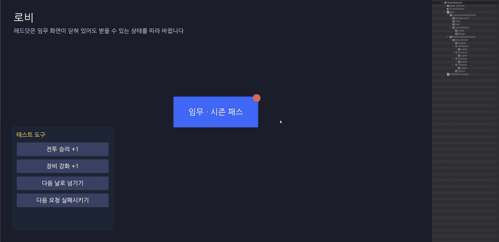

# UI Rebuild Tracker (uGUI)

uGUI에서 **어떤 UI가 얼마나 자주 다시 빌드(Rebuild)되는지** Game 뷰 · Scene 뷰 · Hierarchy에 바로 보여 주는 디버그 도구입니다.

Unity 6.6 (6000.6) · uGUI · 새 Hierarchy / 레거시 Hierarchy 모두 지원



> 1초마다 바뀌는 카운트다운 텍스트가 Graphic 리빌드로 잡히고, Hierarchy에 `GRAPHIC` 배지가 붙는 모습입니다.

## 왜 만들었나

uGUI 성능 문제의 상당수는 불필요한 Canvas 리빌드에서 나옵니다. 텍스트 하나만 바뀌어도 그 요소가 리빌드 큐에 들어가고, Layout이 엮여 있으면 주변 UI까지 다시 계산됩니다.

Profiler는 `Canvas.SendWillRenderCanvases` · `BuildBatch` 같은 **비용의 합계**를 보여 주지만, Canvas 안의 **어떤 Text / Image 때문인지**는 Deep Profile이나 호출 스택을 뒤져야 알 수 있습니다. 녹화 후 프레임을 넘겨 보는 방식이라 "이 버튼을 누르면 무엇이 다시 그려지나"를 조작하면서 바로 보기도 어렵습니다.

그래서 리빌드 큐를 직접 읽어 **누가 · 어떤 종류로 · 얼마나 자주** 리빌드되는지 실시간으로 표시합니다. 이 도구는 원인 찾기용이고 시간(ms)은 재지 않습니다. 의심 가는 UI를 찾고 → Profiler로 비용을 확인하고 → 고친 뒤 이 도구로 리빌드가 사라졌는지 확인하는 식으로 함께 씁니다.

## 표시

| 위치 | 내용 |
| --- | --- |
| Game 뷰 | 외곽선 + `컴포넌트명 (n/60f)` 라벨. 자주 리빌드될수록 빨갛게, 60프레임 중 30회 이상이면 `⚠` 와 깜빡임 |
| Scene 뷰 | 외곽선 (Layout = 빨강, Graphic = 노랑) |
| Hierarchy | 해당 줄 오른쪽에 `LAYOUT` / `GRAPHIC` 배지 |
| Inspector | 추적 중인 UI 개수 (`Tracking UI Count`) |

- **Graphic 리빌드**: 색 · 텍스트 · 스프라이트처럼 그려지는 내용이 바뀐 경우
- **Layout 리빌드**: 크기 · 위치를 다시 계산해야 하는 경우 (`LayoutGroup`, `ContentSizeFitter`, 텍스트 길이 변화 등)

## 사용법

1. 이 폴더를 `Assets/` 아래에 넣습니다.
2. `Debug/UIRebuildTracker.prefab` 을 **씬 루트에 1개** 둡니다. 리빌드 큐는 전역이라 1개로 모든 Canvas를 감지하고, Tracker 자신과 그 자식은 추적에서 빠집니다.
3. Play 후 UI를 조작합니다. `[ExecuteAlways]` 라서 에디터에서 UI를 고칠 때도 표시됩니다.

| 인스펙터 변수 | 기본값 | 의미 |
| --- | --- | --- |
| `Hold Time` | `0.4` | 마지막 리빌드 뒤 진하게 유지하는 시간(초). 한 번만 일어난 리빌드도 눈에 보이게 붙잡아 둡니다. |
| `Highlight Fade Speed` | `3.0` | 그 뒤 흐려지는 속도(초당 감소량). 3.0이면 약 0.33초 만에 사라집니다. |
| `Enable In Runtime` | `true` | Play 모드(및 빌드)에서 추적할지 여부. 끄면 에디터 편집 중에만 동작합니다. |

## 동작 원리

1. uGUI는 리빌드할 요소를 `CanvasUpdateRegistry` 의 `m_GraphicRebuildQueue` / `m_LayoutRebuildQueue` 에 모았다가 `Canvas.willRenderCanvases` 에서 처리하고 비웁니다.
2. Tracker는 그 직전 `LateUpdate` 에서 두 큐를 리플렉션으로 읽어 요소와 프레임 번호를 기록합니다.
3. Game 뷰(`OnGUI`), Scene 뷰(`SceneView.duringSceneGui`), Hierarchy가 같은 데이터를 그립니다. Hierarchy는 새 창이면 `HierarchyWindow.BindViewItem` / `UnbindViewItem` 으로 배지를 붙였다 떼고, 레거시 창이면 `hierarchyWindowItemByEntityIdOnGUI` 로 그립니다.

## 주의

- **디버그 전용**입니다. 출시 빌드에서는 빼거나 `Enable In Runtime` 을 끄세요.
- uGUI 내부 필드를 리플렉션으로 읽으므로, uGUI 버전이 바뀌어 필드 이름이 달라지면 아무것도 표시되지 않을 수 있습니다.
- 다른 스크립트의 `LateUpdate` 보다 먼저 실행되면 그 뒤에 생긴 리빌드는 놓칠 수 있습니다.

## 구성

```
UIRebuildTracker/
├─ UIRebuildTracker.cs            리빌드 큐 수집 + Game 뷰 표시
├─ Editor/UIRebuildTrackerEditor.cs   Scene 뷰 외곽선, Hierarchy 배지, Inspector
├─ Debug/UIRebuildTracker.prefab  씬에 두는 프리팹
└─ Documentation~/                README 이미지 (Unity가 임포트하지 않는 폴더)
```